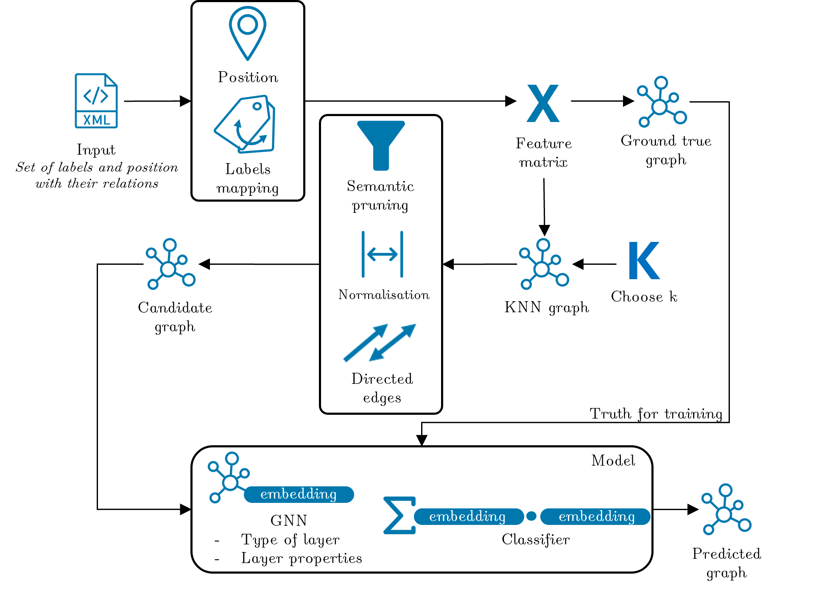

# Music Semantic Reconstruction With Deep Learning
Learning How to Construct Music Notation Graphs With Graphs Neural Networks

## Context 

This repository contain the code of my master thesis (and Projet de Fin d'Etude (PFE)). 
This work has been done for a joint degree between the INSA Lyon (département informatique) and the TU Wien (MSc Data Science).

The script of the thesis can be found here (link to be updated).

## Introduction 

### Optical Music Recognition (OMR)

The Optical Music Recognition (OMR) is a field of research that investigates how to transform non-computer readable scores into computer-readable scores.
In otherwords, the goal of OMR is to convert images of music scores into a computer-readable format like MIDI, MusicXML, or MEI.
To perform this task, OMR systems are usually composed of four main steps:

1. Image preprocessing: The input image is preprocessed to enhance the quality of the image and make the element stand out of the background.
2. Recognition of musical symbols: the different musical primitives of the score are recognised, labelled and associate to a bounding box that localised them.
3. Music Notation Semantic Reconstruction: In traditionnal music notation, the different musical primitives interact and reconstructing these relation is needed to read the music.
4. Encoding: The music notation is encoded into a computer-readable format or any specific output like tablature or Braille scores.

### Music Semantic Reconstruction with Graph Neural network 

The goal of this thesis is to investigate how to reconstruct the music notation semantic from the output of an OMR system.
The musical notation can be seen as a graph where the nodes are the musical primitives and the edges are the relations between them. 
These graphs are referred to as Music Notation Graphs (MuNGs).
Recovering the semantics can be resumed as inferring the edges of the MuNGs.

# Approach

This task can be seen as a link prediction task done by GNNs.
For this work we assume the nodes are perfectly recognised and labelled.
GNNs take graphs as input, unfortunately, the output of a Musical Object detector is a list of primitives with their label and bounding boxes.
This list can easily be converted into a feature vector but lack and adjacency or equivalent to construct a graph.
To handle this issue we proposed a ruled based method to construct the adjacency matrix based on KNN graphs.
The training pipeline is illustrated in the following figure:



# Reproducing the results

To reproduce the results of this thesis, you need to follow the following steps:

1. Clone this repository
2. Install the requirements
3. Download the dataset \
   For dataset other than Musigraphs, additonal steps might be needed: \
   4.1 Generate the dataset splits with the script `doremi_dataset_splitter.py` and ```muscima-pp_dataset_splitter.py``` \
   4.2 Divide the dataset's score by measure with the script `cut_dataset_by_measure.py` \
   4.3 Generate the dataset splits with the script `generate_split_4_measure_cut_datasets.py` \
4. Download the pre-trained models from the github release. 
5. Test the model with the script `test_model.py`

The output of the test is a Tensorboard log that can be visualised with the command `tensorboard --logdir=runs`
